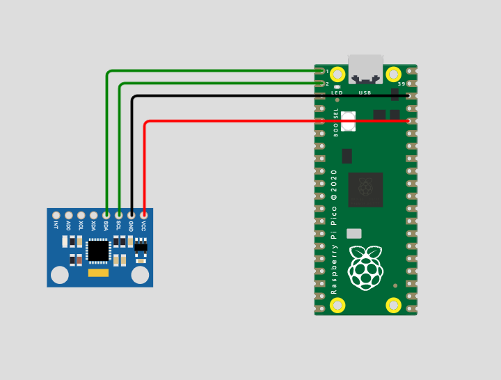

<p align="center">
    
    <br><br>
    <b>Instituto Tecnológico de Tijuana</b><br>
    <b>Depto de Sistemas y Computación</b><br>
    <b>Ing. En Sistemas Computacionales</b><br>
    <b> Acelerometro </b><br>
    <b>Autor : Alejandro Martinez Reyes</b><br>
    <b>Repositorio: Acelerometro </b><br>
    <b>Fecha de revisión:   03/07/2023</b><br>
    <b>Objetivo del programa: Pagina Web Del Acelerometro </b>

</p>
# Acelerometro


###  ¿QUÉ ES UN ACELERÓMETRO?

Los acelerómetros se utilizan en mediciones de aceleración gravitacional estática, lo que le permite determinar el ángulo de desviación del objeto medido de la vertical, así como en mediciones de aceleración dinámica debido a golpes, movimiento, impacto o vibración, es decir, vibraciones de baja amplitud y baja frecuencia, que alcanzan varias docenas de Hz.

- ¿Cómo funciona un acelerómetro mientras se mide la vibración? Este dispositivo se implementa directamente en el objeto que vibra, lo que le permite convertir la energía de vibración en una señal eléctrica que es proporcional a la aceleración momentánea del objeto.

- ¿Qué hace un acelerómetro? La medición de la vibración se usa generalmente para diagnosticar el funcionamiento de máquinas, dispositivos o estructuras sometidas a altos esfuerzos, por ejemplo, estructuras de acero de mástiles, puentes o estructuras de edificios. También se utilizan acelerómetros, entre otros. para proteger los discos duros contra daños, en equipos médicos y deportivos, en cámaras y videocámaras, en teléfonos inteligentes, controles remotos, controladores o en sistemas de navegación.

- ¿Qué es un acelerómetro? No es más que un transductor de aceleración que mide su propio movimiento en el espacio. Hay tres tipos básicos de acelerómetros, más de los cuales más adelante en el artículo.

### ¿CÓMO FUNCIONA UN ACELERÓMETRO?

El principio de los aceleradores no es demasiado complicado. Mide la fuerza de aceleración en la unidad g y puede medir en uno, dos o tres planos. Actualmente, los acelerómetros de 3 ejes más utilizados, cuya construcción consiste en un sistema de tres acelerómetros, cada uno de los cuales mide la aceleración en una dirección diferente, en los planos X, Y y Z. Un ejemplo de un acelerómetro de 3 ejes puede ser un modelo OKYSTAR OKY3230.OKY3230

Si la aceleración en cualquier plano actúa en la dirección opuesta a la dirección del sensor, el acelerómetro medirá la aceleración con un valor negativo. De lo contrario, la aceleración se medirá con un valor positivo.

Si el acelerómetro no se ve afectado por ninguna aceleración externa, el dispositivo solo medirá la aceleración gravitacional, es decir, la fuerza de la gravedad. Suponiendo que el acelerómetro de 3 ejes está posicionado de tal manera que el sensor en el eje X se dirige hacia la izquierda, el sensor en el eje Y está hacia abajo y el sensor en el eje Z está hacia adelante y no actúan fuerzas sobre él, entonces el acelerómetro devolverá valores: X = 0 g, Y = 1 g, Z = 0 g. Si el mismo acelerómetro está inclinado hacia la izquierda, sus lecturas mostrarán: X = 1 g, Y = 0 g, Z = 0 g. Del mismo modo, cuando la desviación se produce a la derecha, el plano X devuelve el resultado X = -1 g. Las dependencias de medición de aceleración dadas son utilizadas por los algoritmos de los sistemas que supervisan el acelerador.

### ¿QUÉ TIPOS DE ACELERÓMETROS HAY?

Hay tres tipos entre los tipos básicos de acelerómetros: acelerómetros capacitivos MEMS, acelerómetros piezoeléctricos y acelerómetros piezorresistivos.

#### Acelerómetros capacitivos MEMS

Los acelerómetros capacitivos que utilizan la tecnología MEMS son los sensores más baratos, más comunes y más pequeños de este tipo. ¿Cómo funciona un acelerómetro? capacitivo MEMS? El principio de su funcionamiento se reduce a colocar el peso montado en los resortes. Un extremo de los resortes está unido a los revestimientos del condensador de peine, mientras que el otro extremo está unido al peso montado. Bajo la influencia de la fuerza que actúa sobre el sensor, el peso se mueve sobre los resortes, lo que provoca un cambio en la distancia entre el elemento de condensación y la masa, y por lo tanto afecta el cambio en la capacidad. Un ejemplo de un acelerómetro MEMS es el modelo SPARKFUN ELECTRONICS INC. DEV-09267 o SPARKFUN ELECTRONICS INC. BOB-13926.
Los acelerómetros capacitivos fabricados con tecnología MEMS se utilizan principalmente en dispositivos portátiles, equipos móviles y productos electrónicos de consumo ampliamente conocidos. Una de las mayores ventajas de los acelerómetros MEMS es la posibilidad de su implementación directamente en la placa de circuito impreso.

Las desventajas de los sistemas MEMS incluyen baja precisión de medición, especialmente para mediciones de amplitudes y frecuencias más altas, lo que los hace inadecuados para aplicaciones industriales especializadas.
#### Acelerómetros piezorresistivos
Los sensores que usan el efecto de piezoresistencia son otro tipo de acelerómetro. ¿Qué hace un acelerómetro piezorresistivo? Su principio de funcionamiento es similar al de un extensómetro, es decir, un extensómetro. Estos tipos de acelerómetros están equipados con material piezorresistivo, que bajo la influencia de la fuerza externa se deforma, provocando un cambio en la resistencia.
El cambio en la resistencia se convierte en una señal eléctrica recibida por el receptor integrado con el acelerador. Los acelerómetros piezorresistivos se caracterizan por una gran banda de medición, gracias a la cual pueden registrar vibraciones de altas amplitudes y frecuencias, lo que es útil, entre otros. durante varias pruebas de choque.
Otra ventaja de los aceleradores piezoresistivos es la capacidad de medir señales de cambio lento, lo que permite su uso en sistemas de navegación inercial para calcular la velocidad y el desplazamiento de los componentes del sistema.
Así que,cómo funciona un acelerómetro piezoeléctrico, lo hace resistente a los cambios en la temperatura ambiente, lo que requiere una compensación de temperatura. Además, los acelerómetros de este tipo tienen problemas para detectar señales débiles, y también son mucho más caros que los acelerómetros capacitivos MEMS.

#### Acelerómetros piezoeléctricos
¿Qué es un acelerómetro piezoeléctrico? Este sensor es uno de los sensores más utilizados para medir el nivel de vibración. Por esta razón, los acelerómetros piezoeléctricos se usan comúnmente en aplicaciones industriales para el diagnóstico o control de maquinaria y equipo. ¿Cómo funciona el acelerómetro piezoeléctrico? Su funcionamiento es similar al funcionamiento de los sistemas piezorresistivos. Sin embargo, bajo la influencia de la aceleración, no cambian su resistencia y generan un voltaje eléctrico de cierto valor.
El elemento de medición de estos sensores suele ser el titanato de circonato de plomo (PZT). El plomo circonato-tataniano por deformación genera una carga eléctrica. Los acelerómetros piezoeléctricos se caracterizan por su alta sensibilidad y precisión, gracias a los cuales se utilizan en muchas aplicaciones, desde mediciones sísmicas extremadamente avanzadas y precisas hasta pruebas de choque y destructivas realizadas en condiciones adversas.
La señal de salida de los acelerómetros piezoeléctricos generalmente está sujeta a amplificación y compensación de temperatura. El cálculo del movimiento del objeto se ve facilitado por la transmisión de la señal a la entrada del integrador.
#### Otros acelerómetros
Otros diseños de aceleradores incluyen diseños IEPE que se usan comúnmente para mediciones de vibraciones. Cabe destacar también los acelerómetros de carga piezoeléctricos, que funcionan bien en temperaturas extremas.

## Tabla


## Ejemplo
Raspberry Pi Pico a Bop It
Para conectar un acelerómetro al Raspberry Pi Pico, se necesitan los siguientes pasos:
- Conectar el pin SCL del acelerómetro al pin GP3 del Pi Pico.
- Conectar el pin SDA del acelerómetro al pin GP2 del Pi Pico.
- Conectar el pin VCC del acelerómetro al pin 3V3 del Pi Pico.
- Conectar el pin GND del acelerómetro al pin GND del Pi Pico.

- SCL: Este es el pin de reloj del bus I2C. Es utilizado para sincronizar las comunicaciones entre el Raspberry Pi Pico y el acelerómetro. En la Raspberry Pi Pico, el pin SCL se encuentra en el pin GPIO1.
- SDA: Este es el pin de datos del bus I2C. Es utilizado para transmitir los datos entre el Raspberry Pi Pico y el acelerómetro. En la Raspberry Pi Pico, el pin SDA se encuentra en el pin GPIO0.



```python
codigo
import time 
import board
import busio    
import adafruit_mpu6050

# define I2c and initial accelerometer values
i2c = busio.I2C(board.GP3, board.GP2)
mpu = adafruit_mpu6050.MPU6050(i2c)

while True:
    print("Acceleration : X: %.2f, Y: %.2f Z: %.2f m/s^2" % (mpu.acceleration))
    print("Gyro X: %.2f, Y: %.2f, Z: %.2f rad/s" % (mpu.gyro))
    print("Temperature: %.2f C" % mpu.temperature)
    print("")
    time.sleep(1)
```
se puede realizar en  CircuitPython o MicroPython

